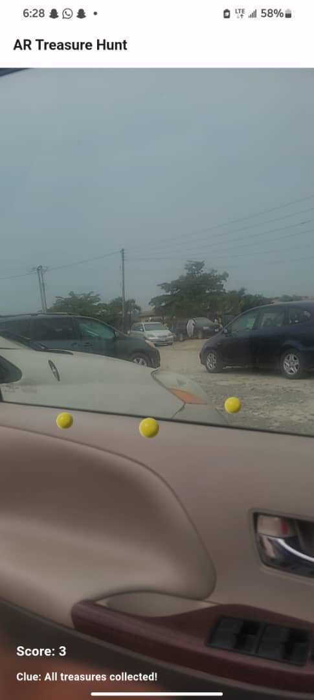

# Mysterium Hunt

Mysterium Hunt is an immersive augmented reality (AR) game that takes players on an adventurous treasure hunt. Dive into a world of hidden mysteries and discover treasures in your surroundings. Developed with Flutter, Mysterium Hunt blends physical and digital worlds, providing a unique gaming experience.

## Table of Contents

- [Features](#features)
- [Installation](#installation)
- [Usage](#usage)
- [Gameplay](#gameplay)
- [Screenshots](#screenshots)
- [Technologies Used](#technologies-used)
- [Contributing](#contributing)
- [License](#license)
- [Contributors](#contributors)

## Features

- **Augmented Reality**: Experience treasure hunting in an immersive AR environment.
- **Interactive Gameplay**: Interact with virtual objects seamlessly integrated into the real world.
- **Engaging Storyline**: Follow a captivating storyline filled with mysteries and adventures.
- **User-Friendly Interface**: Enjoy a smooth and intuitive user experience.

## Download Link 

https://tsfr.io/join/wcf8tw

## Installation

1. **Clone the repository**:
    ```bash
    git clone https://github.com/yourusername/mysterium_hunt.git
    cd mysterium_hunt
    ```

2. **Install dependencies**:
    ```bash
    flutter pub get
    ```

3. **Run the app**:
    ```bash
    flutter run
    ```

## Usage

1. **Launch the app**: Open Mysterium Hunt on your device.
2. **Create an account**: Sign up or log in with your existing account.
3. **Start your quest**: Follow the storyline and begin your treasure hunt.
4. **Explore your surroundings**: Use your device’s camera to discover virtual objects integrated into the real world.

## Gameplay

- **Explore**: Move around your physical environment to find clues and treasures.
- **Interact**: Tap, rotate, and manipulate virtual objects.
- **Collect**: Gather treasures and items that will aid you in your quest.
- **Progress**: Unlock new levels and areas by finding treasures.

## Screenshots





## Technologies Used

- **Flutter**: Cross-platform framework for building the app.
- **ARCore/ARKit**: Augmented Reality frameworks for Android and iOS.

## Contributing

We welcome contributions from the community! If you would like to contribute, please follow these steps:

1. **Fork the repository**: Click the "Fork" button at the top right of the repository page.
2. **Clone your fork**: Clone your forked repository to your local machine.
    ```bash
    git clone https://github.com/yourusername/mysterium_hunt.git
    ```
3. **Create a branch**: Create a new branch for your feature or bug fix.
    ```bash
    git checkout -b feature/your-feature-name
    ```
4. **Make your changes**: Implement your feature or bug fix.
5. **Commit your changes**: Commit your changes to your branch.
    ```bash
    git commit -m "Add feature/your-feature-name"
    ```
6. **Push to your fork**: Push your changes to your forked repository.
    ```bash
    git push origin feature/your-feature-name
    ```
7. **Create a pull request**: Open a pull request to the main repository with a description of your changes.

## License

This project is licensed under the MIT License. See the [LICENSE](LICENSE) file for details.

## Contributors

Slack ID | Email
--- | ---
@Omozua Judah | [iyanuomozua@gmail.com](mailto:iyanuomozua@gmail.com)
@Bigfidelis | [bigfidelisx@gmail.com](mailto:bigfidelisx@gmail.com)
@Shalom | [roselineoladiran97@gmail.com](mailto:roselineoladiran97@gmail.com)
@prodigy_rejoice | [omotunwaserejoice@gmail.com](mailto:omotunwaserejoice@gmail.com)
